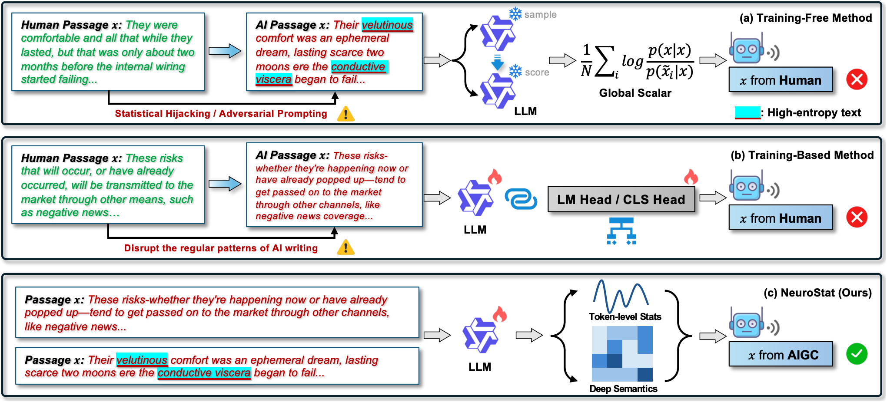
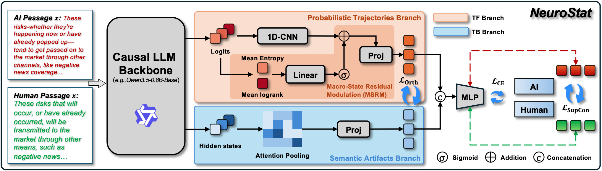
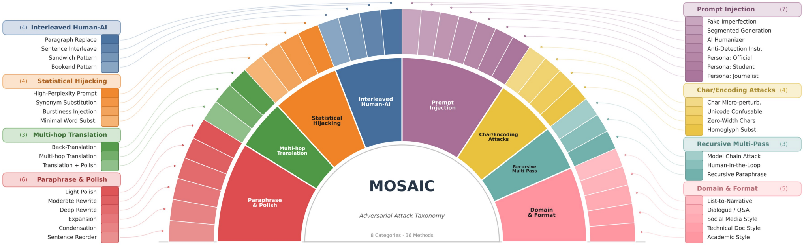

<div align="center">
<h1>Beyond Global Scalars: Synergizing Token-Level Statistics and Deep Semantics for Adversarial AIGC Text Detection</h1>
</div>

<div align="center">
  <a href='https://arxiv.org/abs/2608.28009'></a>
  <a href='https://tencentbac.github.io/NeuroStat/'></a>
  <a href='https://huggingface.co/collections/TencentBAC/neurostat'></a>
  <a href='./LICENSE'></a>
</div>

<br>

<p align="center">
  <b>Peiming Li<sup>1,2</sup>, Yifan Wang<sup>1</sup>, Zhiyuan Hu<sup>1,2</sup>, Shiyu Li<sup>1</sup>, Zheng Wei<sup>1,†</sup>, Yang Tang<sup>1,†,‡</sup></b><br>
  <br>
  <sup>1</sup>Tencent BAC &nbsp;&nbsp; <sup>2</sup>Peking University &nbsp;&nbsp<br>
  <br>
  <sup>†</sup>Corresponding Authors &nbsp;&nbsp; <sup>‡</sup>Project Lead<br>
  <br>
  <i>📧 {ethanntang, hemingwei}@tencent.com</i>
  <br>
  <br>
</p>

---

## Introduction

<div align="center">
  
</div>

This repository hosts the official implementation of **NeuroStat**, the
detector proposed in our EMNLP 2026 Findings paper
*"[Beyond Global Scalars: Synergizing Token-Level Statistics and Deep
Semantics for Adversarial AIGC Text Detection](https://arxiv.org/abs/2608.28009)"*.

Existing machine-generated text detectors fall into two largely disjoint
families: **training-free** methods that rely on global statistical
scalars (e.g. perplexity), and **training-based** methods that leverage
semantic hidden states. Both are brittle under adversarial rewriting:
global scalars are a lossy compression that masks local probability
*burstiness* in interleaved text, while purely semantic models tend to
over-fit spurious "fingerprints" and are easily fooled.

NeuroStat bridges this gap by capturing **uncompressed token-level
probabilistic logits** alongside **deep semantic hidden states** from a
*single* causal-LM backbone in one forward pass, then fusing these
heterogeneous signals via **Macro-State Residual Modulation** — using
global uncertainty indicators to adaptively calibrate local convolutional
features — together with an **orthogonal loss** and a **contrastive
loss** that encourage the two branches to learn complementary
representations. To expose the failure modes of prior detectors, we also
release **MOSAIC**, a 16,000-sample adversarial benchmark spanning the
full spectrum of attack granularities.

- **Token-Level Statistical (TF) Branch**: Processes the uncompressed
  per-token log-probability curve with a 1D-CNN instead of collapsing it
  into global scalars.
- **Macro-State Residual Modulation (MSRM)**: Uses global uncertainty
  indicators (mean entropy, mean log-rank) to residually gate the CNN
  feature map, letting macro-level statistics recalibrate fine-grained
  token dynamics.
- **Deep Semantic (TB) Branch**: Attention-pools the last-layer hidden
  states of the *same* backbone to capture high-level semantic cues that
  purely statistical signals miss.
- **Complementary Fusion**: A supervised contrastive loss shapes the
  fused embedding space, while an orthogonal penalty explicitly encourages
  the two branches to encode non-redundant information.

## Overview

<div align="center">
  
</div>

Given an input text, NeuroStat runs a single forward pass through a
causal-LM backbone to obtain both next-token logits and last-layer hidden
states, then:

- **Extracts** token-level log-probabilities and two macro-state
  uncertainty indicators (mean entropy, mean log-rank) from the logits
- **Encodes** the log-probability curve with a 1D-CNN, residually
  modulated by the macro-state indicators (TF branch)
- **Pools** the semantic hidden states via learnable attention (TB branch)
- **Fuses** `[z_tf ; z_tb]` and classifies with a lightweight MLP head,
  jointly optimized with cross-entropy, supervised contrastive, and
  orthogonal-penalty losses

## Key Features

- **Dual-Branch Architecture**: A single shared backbone drives two
  complementary branches — token-level statistics (TF) and deep semantics
  (TB) — avoiding the cost of running two separate LMs.
- **Macro-State Residual Modulation**: A residual sigmoid gate driven by
  global uncertainty statistics adaptively recalibrates token-level CNN
  features, bridging local and global evidence.
- **Supervised Contrastive + Orthogonal Objective**: Encourages a
  discriminative fused embedding while keeping the TF and TB branches
  informationally complementary rather than redundant.
- **MOSAIC Adversarial Benchmark**: An 8-category adversarial benchmark
  released with this repository, covering interleaving, statistical
  hijacking, translation laundering, paraphrasing, prompt injection,
  character/encoding perturbation, recursive multi-pass generation, and
  domain/format mismatch.
- **Single-Backbone Efficiency**: Both branches are extracted from *one*
  causal-LM forward pass, requiring no external scoring model or separate
  embedding model.
- **Flexible Data Format**: Supports both `MIRAGE` (list-of-pairs) and
  `pair` (twin-list) JSON formats for training and evaluation data.

## MOSAIC Benchmark

<div align="center">
  
</div>

**MOSAIC** is a 16,000-sample adversarial AIGC-text-detection benchmark
released alongside this codebase under [`benchmark/`](https://huggingface.co/collections/TencentBAC/neurostat),
covering eight distinct attack themes spanning the full spectrum of
attack granularities and designed to stress-test detectors beyond
standard in-domain evaluation:

| Tag | File | Attack theme |
|---|---|---|
| `cat1` | `cat1_interleaved_human_ai.json`    | Interleaved Human–AI text |
| `cat2` | `cat2_statistical_hijacking.json`   | Statistical hijacking of global scalars |
| `cat3` | `cat3_translation_laundering.json`  | Cross-lingual translation laundering |
| `cat4` | `cat4_paraphrase_polish.json`       | Paraphrase / polish attacks |
| `cat5` | `cat5_prompt_injection.json`        | Prompt injection |
| `cat6` | `cat6_character_encoding.json`      | Character / encoding perturbations |
| `cat7` | `cat7_recursive_multipass.json`     | Recursive / multi-pass generation |
| `cat8` | `cat8_domain_format.json`           | Out-of-domain / format mismatch |

Each file follows the `MIRAGE` pair format (`{"original": ..., "rewritten": ...}`)
described below, so any detector — not just NeuroStat — can be evaluated
against it.

## Requirements

- Python >= 3.10 (uses PEP 604 union syntax)
- PyTorch >= 2.0
- Transformers >= 4.40
- Accelerate >= 0.28
- A CUDA-capable GPU is recommended for training and evaluation

## Installation

```bash
git clone https://github.com/TencentBAC/NeuroStat.git
cd NeuroStat
pip install -r requirements.txt
```

## Data Preparation

Two JSON formats are supported via the `--*_data_format` flag:

1. **`MIRAGE`** — a list of `{original, rewritten}` pairs (used by the
   MOSAIC benchmark and by most public detection datasets):
   ```json
   [
       {"original": "Human-written text ...", "rewritten": "Machine-generated text ..."},
       {"original": "...",                    "rewritten": "..."}
   ]
   ```
2. **`pair`** — two parallel lists:
   ```json
   {"original": ["...", "..."], "rewritten": ["...", "..."]}
   ```

Within every pair, `original` is the **human-written** example (label = 0)
and `rewritten` is the **machine-generated** example (label = 1). Any extra
fields (e.g. `category`, `sub_method`) are ignored by the loader and may be
kept for analysis purposes — the MOSAIC files shipped in `benchmark/` take
advantage of this. See [`data/README.md`](./data/README.md) for full
details on where to place your own training/evaluation JSON files.

## Training

Minimal command:

```bash
python train.py \
    --model_name_or_path Qwen/Qwen2-0.5B \
    --train_data_path data/train.json \
    --train_data_format MIRAGE \
    --output_dir ./ckpt/neurostat
```

Or via the shell wrapper (every field has a sensible default and can be
overridden by environment variables):

```bash
MODEL_NAME_OR_PATH=Qwen/Qwen2-0.5B \
TRAIN_DATA=data/train.json \
OUTPUT_DIR=./ckpt/neurostat \
bash scripts/train_neurostat.sh
```

Key architecture / loss hyper-parameters:

| Argument | Default | Description |
|---|---|---|
| `--tf_dim` / `--tb_dim` | 64 / 64 | Output dimension of the TF / TB branch |
| `--lambda_supcon` | 0.1 | Weight of the supervised contrastive loss |
| `--supcon_temperature` | 0.07 | Temperature for the SupCon loss |
| `--lambda_orth` | 1e-3 | Weight of the TF–TB orthogonal penalty |
| `--freeze_backbone` | 0 | 1 = freeze the CausalLM backbone, 0 = full fine-tune |

## Evaluation

### Single pair-format file

```bash
python eval.py \
    --model_name_or_path ./ckpt/neurostat \
    --eval_data_path data/test.json \
    --eval_data_format MIRAGE \
    --save_path ./results/neurostat \
    --save_file test.json \
    --skip_best_threshold
```

The output JSON includes AUROC / AUPR / MCC / Balanced Accuracy / TPR at
FPR = 5%, as well as the raw per-sample scores for downstream plotting.

### MOSAIC benchmark (8 adversarial categories)

One command evaluates a trained checkpoint on all 8 MOSAIC categories:

```bash
MODEL_PATH=./ckpt/neurostat \
SAVE_PATH=./results/neurostat_mosaic \
bash scripts/eval_mosaic.sh
```

Per-category result JSONs (`MOSAIC_cat1.json` … `MOSAIC_cat8.json`) are
written to `${SAVE_PATH}`. To evaluate on a custom MOSAIC-style directory,
override `MOSAIC_DIR`:

```bash
MODEL_PATH=./ckpt/neurostat \
MOSAIC_DIR=/path/to/another/benchmark \
SAVE_PATH=./results/other_mosaic \
bash scripts/eval_mosaic.sh
```

## Project Structure

```
NeuroStat/
├── neurostat/                    # core package
│   ├── __init__.py
│   ├── model.py                  # NeuroStatDetector + FusionClassifier + builder
│   ├── features.py               # TF (1D-CNN + Macro-State Residual Modulation) + TB (attn-pool) feature extractors
│   ├── losses.py                 # SupCon + orthogonal penalty
│   ├── data.py                   # datasets / collator / sample builder
│   ├── metrics.py                # AUROC, AUPR, MCC, Balanced Acc, TPR@FPR=5%
│   └── utils.py                  # model-path resolution helper
├── train.py                       # training entry point
├── eval.py                        # evaluation entry point
├── scripts/
│   ├── train_neurostat.sh        # train with default hyper-parameters
│   ├── eval_neurostat.sh         # evaluate on a single pair-format JSON
│   └── eval_mosaic.sh            # evaluate on all 8 MOSAIC categories
├── benchmark/                    # MOSAIC adversarial benchmark (released)
│   ├── cat1_interleaved_human_ai.json
│   ├── cat2_statistical_hijacking.json
│   ├── cat3_translation_laundering.json
│   ├── cat4_paraphrase_polish.json
│   ├── cat5_prompt_injection.json
│   ├── cat6_character_encoding.json
│   ├── cat7_recursive_multipass.json
│   └── cat8_domain_format.json
├── data/
│   └── README.md                 # expected data formats for training data
├── docs/
│   ├── index.html                # project page
│   └── fig/                      # figures used in README / project page
├── README.md
├── LICENSE
└── requirements.txt
```

## Citation

If you find NeuroStat or the MOSAIC benchmark useful in your research,
please cite our paper:

```bibtex
@misc{li2026globalscalarssynergizingtokenlevel,
      title={Beyond Global Scalars: Synergizing Token-Level Statistics and Deep Semantics for Adversarial AIGC Text Detection}, 
      author={Peiming Li and Yifan Wang and Zhiyuan Hu and Shiyu Li and Zheng Wei and Yang Tang},
      year={2026},
      eprint={2608.28009},
      archivePrefix={arXiv},
      primaryClass={cs.CL},
      url={https://arxiv.org/abs/2608.28009}, 
}
```

## License

See [`LICENSE`](./LICENSE).

## Acknowledgments

This repo benefits from the excellent work [DetectAnyLLM](https://github.com/fjc2005/DetectAnyLLM) and [Qwen2](https://github.com/QwenLM/Qwen).
